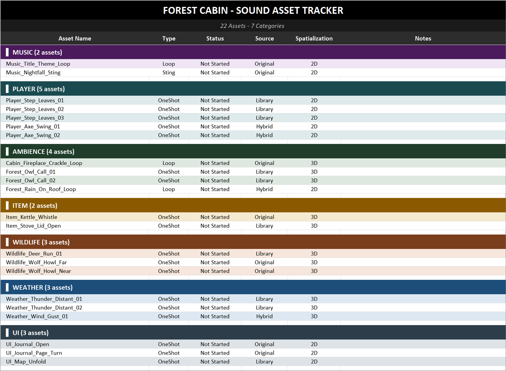

# sound-asset-tracker

Turns a game's sound list into a colour-coded Excel tracker, so you can follow every sound from "Not Started" to "Done".

A sound list is easy to keep as a text file or a CSV export. Tracking it is another job: each sound needs a status, its source and spatialization should be visible at a glance, and a long list is easier to work through when it is split by category. Building that by hand in Excel, with colours and dropdowns, takes time and has to be redone whenever the list changes. `sound_tracker.py` builds the whole sheet from the list in one command.

## Install

You need Python 3.10 or newer. Open a terminal in this folder, then follow the steps for your system.

**Windows**

```
python -m venv .venv
.venv\Scripts\activate
pip install -r requirements.txt
```

If PowerShell refuses to run the activate script, skip that line and type `.venv\Scripts\python` wherever this README says `python`. For example: `.venv\Scripts\python -m pip install -r requirements.txt`.

**macOS and Linux**

```
python3 -m venv .venv
source .venv/bin/activate
pip install -r requirements.txt
```

On Ubuntu, if `python3 -m venv` says that venv is not available, install it first with `sudo apt install python3-venv`.

Once the environment is active, `python` starts its Python on every system, so the commands below use `python`. The only dependency is [openpyxl](https://openpyxl.readthedocs.io/).

## Example

The `examples` folder holds a sound list for a made-up game. From this folder, run:

```
python sound_tracker.py examples/sounds_example.csv --title "Forest Cabin" -o tracker.xlsx
```

Output:

```
Read 22 sounds in 7 categories from examples/sounds_example.csv
  MUSIC           2
  PLAYER          5
  AMBIENCE        4
  ITEM            2
  WILDLIFE        3
  WEATHER         3
  UI              3
Saved tracker.xlsx
```

Run the same command again and it refuses, because `tracker.xlsx` now exists:

```
error: tracker.xlsx already exists; use --force to replace it
```

### What the sheet looks like

Opened in Excel, `tracker.xlsx` has one sheet, "Asset Tracker":

- **Row 1:** the title, `FOREST CABIN - SOUND ASSET TRACKER`, in white on black.
- **Row 2:** the counts, `22 Assets - 7 Categories`.
- **Row 3:** the column headers: Asset Name, Type, Status, Source, Spatialization, Notes. Rows 1 to 3 stay in view while you scroll.
- **Then one section per category**, in the order the categories first appear in your list. Each section starts with a coloured header such as `▌ PLAYER (5 assets)`. Its sounds follow, with rows alternating between a light tint of the category colour and white, and a thin empty row closes the section.
- Every sound starts with the Status `Not Started`. The Notes column is left empty for you.
- **Dropdowns** sit on the sound rows only, never on the headers or the empty rows:
  - Type: OneShot, Loop, Sting
  - Status: Not Started, Recording, Editing, Mixing, Done
  - Source: Original, Library, Hybrid
  - Spatialization: 2D, 3D



## Your sound list

### CSV

The first line is the header row (a blank first line stops the run). It can have any of these columns, in any order and in any mix of capitals. Only `name` is required.

| Column | What goes in it | If it is empty or missing |
|---|---|---|
| `name` | The sound's name, e.g. `Player_Axe_Swing_01` | Required |
| `category` | The section it goes in, e.g. `AMBIENCE` | The part of the name before the first underscore, in capitals: `Player_Axe_Swing_01` goes in `PLAYER` |
| `type` | `OneShot`, `Loop` or `Sting` | `OneShot` |
| `source` | `Original`, `Library` or `Hybrid` | Left empty |
| `spatial` | `2D` or `3D` | Left empty |

- Values are matched without caring about capitals, spaces or hyphens, so `loop`, `One-Shot` and `3d` all work. Any other value stops the run with an error that names the line, because it is usually a typo.
- Category names are written in capitals, so `Ambience` and `AMBIENCE` end up in the same section.
- Any other column (for example `Status` or `Spatialization`) is not used. The tracker is still built, and one warning line lists the columns that were skipped:

  ```
  warning: ignored the columns Status, Spatialization in status.csv; the columns used are name, category, type, source, spatial
  ```

- The file must be UTF-8. In Excel, use **Save As > CSV UTF-8**.
- Files that use semicolons instead of commas work too (Excel saves them that way in many European languages). The header row decides: whichever of the two it has more of, outside quotes, separates the columns.
- Empty rows are skipped.
- A cell with a line break (Alt+Enter in Excel) or a tab stops the run with an error that names the line and the column. This applies to every column, including ones the tracker doesn't use. Remove the line break or tab and run it again. A quote (`"`) that is opened and never closed gives the same error, because the rows after it are read as part of one cell.
- An invisible control character (codes 0 to 31, sometimes copied in from other programs) also stops the run, because an Excel file cannot store it.
- Everything is stored as plain text, so a name that starts with `=` stays a name and is never turned into an Excel formula.

### TXT

One sound name per line. Blank lines and lines starting with `#` are skipped. Each sound takes its category from its name, its type is `OneShot`, and source and spatialization are left empty.

A name with a tab in it stops the run: remove the tab, or if the list has several columns, save it as a CSV file. Invisible control characters stop the run too, as in a CSV.

For example, a file with the lines `Player_Step_01`, `Player_Step_02` and `UI_Click` gives two sections: `PLAYER` with 2 sounds and `UI` with 1.

## Options

| Option | What it does |
|---|---|
| `sound_list` | Your sound list, a `.csv` or `.txt` file. |
| `-t`, `--title` | The game or project name for the title row. Without it, the title is just `SOUND ASSET TRACKER`. Like the list, it cannot contain control characters. |
| `-o`, `--output` | Where to save the tracker. It must end in `.xlsx`. Without it, the tracker is saved next to the sound list with the same name: `sounds.csv` gives `sounds.xlsx`. |
| `--force` | Replace the output file if it already exists. Without it, an existing file is never changed. |
| `-h`, `--help` | Show these options. |

## Colours

Eight categories have fixed colours: MUSIC, ENEMY, PLAYER, ITEMS, ENVIRONMENT, AMBIENCE, VO and UI.

Some shorter spellings get the same colour, because categories often come from name prefixes: ITEM (as in `Item_Kettle_Whistle`) gets the ITEMS colour, ENV gets ENVIRONMENT, AMB gets AMBIENCE, ENEMIES gets ENEMY and DIALOGUE gets VO. The section keeps the name it was given, so `ITEM` and `ITEMS` would be two sections in the same colour.

Every other category takes the next colour from a list of eight extra colours, in the order the categories first appear (after eight, the list starts again). In the example, WILDLIFE and WEATHER get the first two. The same sound list therefore always gets the same colours.

To change any of this, edit `PALETTE`, `COLOUR_ALIASES` and `FALLBACK_COLOURS` near the top of `sound_tracker.py`.

## When something is wrong

Every problem prints one line starting with `error:` and exits with code 1, and nothing is written. For example, a CSV without a `name` column:

```
error: bad.csv has no 'name' column in its header row (found: title, kind)
```

The same goes for:

- a missing file, or a folder given instead of a file
- an empty list, a blank first line, or a CSV the csv reader cannot read
- a value that isn't in a dropdown
- a value, header or title with a line break, a tab or a character Excel cannot store
- a value, header or title longer than 32,000 characters (an Excel cell holds at most 32,767, and longer text would be cut off)
- an output file that already exists, or an output folder that doesn't exist

The only other message is the warning about unused CSV columns described above. It appears after a successful run, and the tracker is built anyway.

## Requirements

- Python 3.10 or newer
- openpyxl 3.1 or newer
- Tested on Windows and on Linux (Ubuntu), with the tracker opened in Microsoft Excel.

## Known limits

- It builds a new tracker every time. It does not update an existing one, so statuses and notes you have typed in are not carried over if you rebuild. Add later sounds to the sheet by hand, or rebuild before you start tracking.
- It reads `.csv` and `.txt` lists only, not `.xlsx`.
- The dropdown choices are fixed. To change them, edit `TYPE_CHOICES`, `STATUS_CHOICES`, `SOURCE_CHOICES` and `SPATIAL_CHOICES` near the top of `sound_tracker.py`.
- The dropdowns offer their choices, but Excel still lets you type a different value into the cell.
- Names without a prefix (`Thunder`, `Rain`) each become their own category. Add a `category` column to group them.
- Other spreadsheet programs (LibreOffice, Google Sheets, Numbers) were not tested.

## Running the tests

```
pip install pytest
python -m pytest
```

## License

MIT. See [LICENSE](LICENSE).
